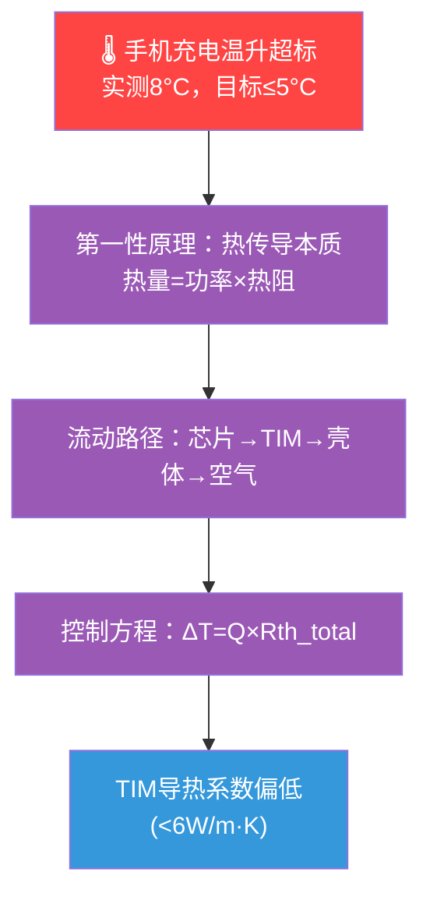

# ceae-skill — 硬件产品参数根因分析（TRIZ小组协作模式）

## 适用对象
硬件产品参数优化工程师。输入含量值的工程目标，输出可操作的关键问题列表 + Mermaid 因果图 + PNG 存档图。

**本技能只有一种模式：TRIZ 小组协作模式。**

---

## 核心约束速查表（唯一权威版本）

> 以下 6 条约束是本技能运行的最高优先级规则。正文各步骤是对这 6 条的展开说明，遇到冲突以此表为准。

| # | 约束 | 一句话规则 |
|---|------|-----------|
| A | 节点内容 | 只描述问题状态，严禁写原因或后果 |
| B | 因果链展开 | 不跳不漏，按原理原则展开，穷举所有角色视角 |
| C | 知识边界 | 任何角色不得以专业限制为由停止追问，必须向小组发问 |
| D | 第一性原理 | 根节点直接子节点必须全部是紫色 principle 节点，第4层起才出现缺陷节点 |
| E | 追问深度 | 重要分支≥7层缺陷节点，一般分支≥4层；终点是参数矛盾或边界终点，不是规范缺失 |
| F | 协作模式 | 七步流程是每个角色独立执行的分析方法，TRIZ小组是组织形式，两者不可分离，无单人模式 |

---

## 两层结构关系说明

```
【组织层】TRIZ小组协作流程（T-Step 0 → T-Step 4）
    ↓ 每个角色在 T-Step 1 独立执行：
【方法层】七步分析流程（Step 1 → Step 7）
```

- **T-Step** = 小组级别的协作节点（全体参与）
- **Step** = 每个角色独立执行的分析步骤
- T-Step 0 / T-Step 0.5 由4人共同完成，结果作为 Step 1 / Step 1.5 的共识输入

---

## 方法层：七步分析流程（每个角色独立执行）

**Step 1：目标参数化**
将模糊问题转化为含边界、量值、测量方法的工程目标。
- 示例：「手机充电温升超标」→「充电过程中手机表面温升 ≤ 5°C（红外测温仪，满电状态，环境25°C），实测8°C，超标3°C」

**Step 1.5：第一性原理三层框架**（强制不可跳过）

```
第1层（本质定义）：这个物理现象是什么？
    ↓
第2层（流动路径）：物理量通过哪些路径传递？A→B→C→D→输出
    ↓
第3层（控制方程）：每种机制的控制方程是什么？锁定所有可量化参数
    ↓
第4层起：按方程参数逐一追问缺陷节点（才开始出现蓝/绿/灰/红橙节点）
```

> 前3层在因果图中全部以**紫色节点**画出，不含任何缺陷描述。

**Step 2：寻找顶层公式**
从第3层控制方程出发，找出直接影响目标参数的物理/工程公式。
- 示例（温升问题）：`ΔT = Q × Rth_total`，其中 `Rth_total = Rth_chip + Rth_TIM + Rth_case + Rth_air`
- 示例（变形问题）：`δ_max = FL³/48EI`，其中 `E`=弹性模量、`I`=截面惯性矩、`L`=跨度、`F`=载荷

**Step 3：递归展开公式参数**

从顶层公式逐层拆解，规则如下：

```
① 每个参数逐一追问：「这个参数偏高/偏低的原因是什么？」
② 展开停止条件（满足任一即可停止展开，转为终点判断）：
   - 参数已可直接测量并调节 → 绿色关键缺陷
   - 参数与其他参数产生物理矛盾 → 红橙矛盾终点
   - 参数受物理/项目边界限制 → 灰色边界终点
③ 公式→穷举切换条件：
   - 当某参数无法用公式继续拆解时，切换为 Step 4「机料法环测穷举」
   - 切换后穷举结果仍需接受 Step 5 终点条件判断
```

**Step 4：机料法环测穷举**
无公式时，按五类穷举所有可能原因：
- 机（设备/结构）、料（材料）、法（工艺/规范）、环（环境）、测（检测）

**Step 5：判断终点条件**

节点关闭前强制自检两问：
```
自检①：这个参数可以直接调节吗？
  → 可以 → 标为✅关键缺陷（绿色）
  → 不可以 → 进入自检②
自检②：不能调节是因为和哪个参数产生矛盾？
  → 找到矛盾参数对 → 标为「参数矛盾终点」（红橙色）
  → 是物理/法规/项目边界 → 标为「边界终点」（灰色）
```

合法终点：参数可直接调节 / 参数矛盾 / 物理材料极限 / 项目边界 / 自然现象 / 再追无工程意义
**非合法终点：「规范/SOP/IQC缺失」— 必须继续追问到参数矛盾或边界终点**

**Step 6：筛选关键缺陷**
从末端选出绿色关键缺陷节点，即改善后可实现或部分实现目标的节点。

**Step 7：输出关键问题列表**
将关键缺陷转化为：「如何解决[对象][参数问题]，以实现[量化目标]？」

---

## 组织层：TRIZ小组协作流程

### 角色定义

| 角色 | 关注领域 |
|------|---------|
| 🔧 机械结构工程师 | 结构尺寸、装配公差、热传导路径、流体通道 |
| 🧪 材料工程师 | 材料热学/力学参数、材料失效、界面结合 |
| ⚡ 电气工程师 | 电路功耗、信号完整性、电源管理、EMC |
| 🏭 生产制造工程师 | 工艺一致性、设备精度、SOP规范、IQC |

### 协作步骤

**T-Step 0：参数化目标**（4人共同完成，对应 Step 1）

当用户输入模糊时，使用以下标准引导话术：

> 「我需要先把这个问题参数化，请帮我确认以下信息：
> 1. **目标参数**：你要优化的是哪个具体物理量？（如：温升、变形量、噪音声压级）
> 2. **目标值**：设计要求是多少？（如：≤5°C、≤0.5mm、≤45dB）
> 3. **实测值**：目前实际测量结果是多少？
> 4. **测量条件**：用什么仪器、在什么工况下测量的？
> 5. **超标量**：超出目标多少？（帮助判断分析深度）
>
> 示例格式：『充电过程中手机表面温升≤5°C（红外测温仪，满电，环境25°C），实测8°C，超标3°C』」

- ✅ 确认点：4人对量化目标达成共识后，才进入下一步

**T-Step 0.5：第一性原理三层框架**（4人共同完成，对应 Step 1.5）
- 画出完整流动路径图，紫色节点在因果图中占据根节点的全部直接子层
- ✅ 确认点：4人确认紫色层完整后，才进入各自独立分析

**T-Step 1：各角色独立发散**（每人执行 Step 2→Step 3→Step 4→Step 5→Step 6）
- 重要分支≥7层缺陷节点，一般分支≥4层
- 遇到超出本专业节点，向小组其他成员发问，由最相关角色接力展开
- 输出：每个角色完整因果树（含节点颜色标注）

**T-Step 2：跨角色审查**
- 逐节点检查，每位工程师补充本专业视角
- 物理含义不同的原因一律保留

**T-Step 3：比重投票**
- 争议节点每人1～5打分，均值收敛后标注 W:★/★★/★★★
- 所有争议节点全部保留，不删除

**T-Step 4：合并输出**

合并4棵因果树遵循以下三原则：

```
合并三原则：
① 同节点去重规则：
   - 文字描述相同或高度相似（同一物理参数的不同表述）→ 合并为一个节点，保留最精确表述
   - 文字相似但物理含义不同 → 保留两个节点，加括号注明角色来源（如：[🔧][🧪]）

② 路径差异保留规则：
   - 不同角色对同一父节点的不同子节点展开 → 全部保留，作为并列分支
   - 不同角色对同一节点的不同追问深度 → 取最深版本，合并其余角色的补充角度

③ 根节点层级统一规则：
   - 合并后检查：根节点的所有直接子节点必须全部是紫色节点
   - 若合并后出现非紫色节点直接挂在根节点下 → 补充对应的紫色原理层节点
```

- 最终确认：所有节点含4角色视角 / 重要分支已达≥7层 / 根节点直接子节点全部为紫色
- ✅ 确认点：Mermaid 图输出后等待用户确认，再执行 PNG 脚本

---

## 节点规范

### 节点内容规则

**只描述问题状态，严禁写原因或后果。**

| 写法 | 示例 |
|------|------|
| ❌ 写了原因 | TIM导热系数偏低，导致热阻增大 |
| ❌ 写了后果 | PMIC档位粒度不足，造成功耗偏高 |
| ✅ 正确写法 | TIM材料导热系数偏低（<6W/m·K） |

**节点文字模板：**「[对象] 的 [参数/属性] [偏高/偏低/缺失/超差/不足/未规定…]（可附量值）」

### 节点颜色

| 颜色 | 含义 |
|------|------|
| 红 | 根节点（问题起点） |
| 紫 | 第一性原理层（前3层，不含任何缺陷） |
| 蓝 | 中间节点（可继续追问） |
| 绿 | 关键缺陷（参数可直接调节）✅ |
| 橙 | 争议节点（含比重标注） |
| 红橙 | 参数矛盾终点（两参数相互制约） |
| 灰 | 边界终点（物理极限/项目范围/自然现象） |

### Mermaid 输出模板



### PNG 脚本调用

```python
# 脚本路径：@skillfs:ceae-skill/scripts/ceae_tree_export.py
# 调用方式：通过 python 工具执行
# 输入：Mermaid 文本或节点字典
# 输出：PNG 文件（含右下角颜色图例）
# 校验：根节点直接子节点必须全部为紫色，否则报错终止
```

---

## 输出结构

```
第一部分：  参数化目标（含量值、边界、测量方法）
第二部分：  第一性原理三层框架（文字说明）
第三部分：  各角色独立分析摘要（4角色分别列出）
第四部分：  比重投票记录（争议节点列表）
第五部分：  合并因果树
            ├─ Mermaid 图（在线预览）← ✅ 等用户确认后
            └─ PNG 存档图（执行脚本导出）
第六部分：  关键问题列表
```

---

## 边界情况处理

| 情况 | 处理方式 |
|------|---------|
| 用户输入太模糊（如「电机噪音偏大」） | 暂停，使用 T-Step 0 标准引导话术，逐项收集5个参数化信息 |
| 某角色遇到超出专业的节点 | 向小组发问，不得停止，由最相关角色接力 |
| 遇到「规范缺失」 | 不是终点，继续追问：该参数能直接调节吗？会和哪个参数产生矛盾？ |
| 争议节点无法收敛 | 全部保留，标注比重，不强制删除 |
| 合并时遇到相似节点 | 按合并三原则处理，优先保留物理含义差异 |

## 使用前配置
本 Skill 依赖智慧芽开放平台 MCP 服务：
- 完成安装、初次使用时需进行自检，参见 README.md
- 用户需完成账号授权，并确保 Agent 环境已启用对应 MCP 工具
- 若未完成配置，本 Skill 只能提供分析框架，无法检索实时数据或生成基于数据库的结论
- 缺少MCP配置时，引导用户参照 README.md 在 [[open.zhihuiya.com](https://open.zhihuiya.com/)](https://open.zhihuiya.com/) 获取MCP。
