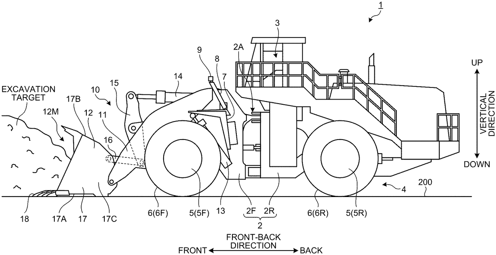

# 徐工集团关注的自卸车专利简报（2026年2-3月公开）

> 生成时间：2026-04-16 15:26

## 一、新公开专利概况

- **检索式**：`ANCS:(株式会社小松制作所 or Mitsubishi Heavy Industries or 徐工集团工程机械) and MIPC:(E02F) and PBD:[20260201 TO 20260330] and TAC_ALL:(自卸车)`
- **专利总数**：1

| 公司 | 专利数 |
|------|--------|
| 全部 | 1 |

## 二、专利技术总结

### 全部（1 件）
- **主要技术方向**：进行成像（1件）
- **代表性技术**：监测系统配备第一和第二成像装置,分别以特定视角拍摄工作设备和地面的图像,利用缺陷和巨石检测单元分别确定缺陷和巨石。

## 三、专利详情

### 全部（1 件）
#### 进行成像（1 件）
##### [US20260071412A1](https://analytics.zhihuiya.com/patent-view/abst?_type=query&source_type=search_result&rows=20&patentId=a9a494dc-9fc6-44b6-8582-13f89e8fa099)
- **标题**：Work machine monitoring system and work machine monitoring method
- **法律状态**：实质审查
- **申请人**：KOMATSU LTD.
- **申请日**：20230203
- **公开日**：20260312
- **技术问题**：由于工作内容和环境的变化,工作机器存在损坏的风险,因此需要进行实时监控,以防止或及早发现损坏。
- **技术手段**：监测系统配备第一和第二成像装置,分别以特定视角拍摄工作设备和地面的图像,利用缺陷和巨石检测单元分别确定缺陷和巨石。
- **技术功效**：能够实时监控工作机器的状态,及早发现缺陷和潜在危险,从而防止损坏。
- **摘要附图**：

## 四、相关期刊文献

- **命中文献数**：1455（展示前 20 条）

### 1. Tipper
- **作者**：Dai, Yibo、Karalis, George、Kawas, Saba、Olsen, Chris
- **期刊**：Proceedings of the 33rd Annual ACM Conference Extended Abstracts on Human Factors in Computing Systems，2015，pp.1773-1778
- **DOI**：[10.1145/2702613.2732796](https://doi.org/10.1145/2702613.2732796)
- **引用次数**：文献引用 4 次、专利引用 10 次
- **摘要**：Most senior citizens in the U.S. use the Internet on a regular basis yet frequently run into basic issues they cannot solve themselves. We conducted contextual inquiry with 6 participants and an online survey with 25 participants to determine the difficulties and frustrations these users face. From the research findings we designed Tipper, a browser-based system to provide contextual help for seniors on the Web. Usability testing shows Tipper to be a simple yet powerful solution to make seniors more competent and comfortable on the Web. This paper reports the current progress of Tipper and indicates our future direction.

### 2. Dumping Car
- **期刊**：Scientific American，1885，Vol.19(475supp)，pp.7578-7578
- **DOI**：[10.1038/scientificamerican02071885-7578asupp](https://doi.org/10.1038/scientificamerican02071885-7578asupp)

### 3. Dumping Car
- **期刊**：Scientific American，1884，Vol.51(14)，pp.210-210
- **DOI**：[10.1038/scientificamerican10041884-210c](https://doi.org/10.1038/scientificamerican10041884-210c)

### 4. dumper
- **期刊**：Dictionary of Gems and Gemology，pp.286-286
- **DOI**：[10.1007/978-3-540-72816-0_7004](https://doi.org/10.1007/978-3-540-72816-0_7004)

### 5. Dumping Car
- **期刊**：Scientific American，1885，Vol.1(2build)，pp.47-47
- **DOI**：[10.1038/scientificamerican12011885-47bbuild](https://doi.org/10.1038/scientificamerican12011885-47bbuild)

### 6. Tipper Gore
- **期刊**：East Tennessee Newsmakers，2024，pp.44-47
- **DOI**：[10.2307/jj.28697809.14](https://doi.org/10.2307/jj.28697809.14)

### 7. Dumping Car
- **期刊**：Scientific American，1885，Vol.53(21)，pp.323-323
- **DOI**：[10.1038/scientificamerican11211885-323b](https://doi.org/10.1038/scientificamerican11211885-323b)

### 8. Dumper derailment investigation and development of custom check rail
- **作者**：Lindsay Dobson
- **摘要**：Rio Tinto Iron Ore owns and operates the largest privately owned rail system in Australia, with approximately 1700km of mainline, servicing 15 different mine sites. To haul the iron ore from the mines the railway utilises 191 locomotives and approximately 11500 wagons. The ore is loaded into the wagons whereby it is transported via rail to one of 3 ports for
export.

The unloading of the wagons at the port is done via a rotary car dumper, whereby the wagon enters the process inside of the dumper and the wagon is turned 100° axially to dump the ore into a chute. Once dumped the wagon is returned to original orientation and evacuated via an indexing arm and the process repeated.

Rio Tinto Iron Ore have experienced regular derailments on the outgoing side of the car dumpers at their Parker Point operations, known as CD3P/CD4P, in the Pilbara since their installation in 2007. The outgoing track section has seen an increased number of derailments in the final quarter of 2015 and again in the first quarter of 2016, adding pressures to find a route cause and solution. As a mitigation measure in 2012 a non-active checkrail was installed in an attempt to return the low leg wheel set to alignment once flange climb had occurred. This has proved to be ineffective with the checkrail at CD3P and CD4P currently installed such that it does not fulfil its intended function. In the current alignment and orientation, the checkrail does not contact the wheel until the opposing wheel has derailed and moved over centre of the high leg rail.

This work investigates existing site conditions at the location and assesses them in line with the generally accepted standards and identifies a root cause.

### 9. Dumper Truck Racing
- **作者**：Joe Gates

### 10. Dump Truck Permit
- **作者**：pTools

### 11. New Dump Car
- **期刊**：Scientific American，1880，Vol.42(20)，pp.306-307
- **DOI**：[10.1038/scientificamerican05151880-306a](https://doi.org/10.1038/scientificamerican05151880-306a)

### 12. South Side of Highway Dump
- **作者**：Dallas (Tex.)
- **摘要**：Photograph of the south side of a washout dump along Highway #10. Photograph faces west and was taken at 11:40 am.

### 13. The Research of Cavity Dumper Driver
- **作者**：Sheng Cuixia
- **期刊**：Journal of Changchun Institute of Optics and Fine Mechanics，2004
- **摘要**：In this article we introduce the theory of the cavity dumper theory,l design the cavity dumper driver and test it. The cavity dumper driver designed by us can drive the a cousto-optic cell output the different repeated rate laser pulse signal whose are 4MHz、8KHz、400KHz、80KHz、40KHz、8KHz、4KHz、800Hz、400Hz,etc. So that it can meet the need of laser in different research.

### 14. D. Kipper &amp; S. Whitney. The Addiction Solution: Unraveling the Mysteries of Addiction through Cutting-Edge Brain Science
- **作者**：James P. Foster
- **期刊**：Alcoholism Treatment Quarterly，2013，Vol.31(1)，pp.161-163
- **DOI**：[10.1080/07347324.2013.746614](https://doi.org/10.1080/07347324.2013.746614)

### 15. Improved Dumping Wagon
- **期刊**：Scientific American，1874，Vol.31(8)，pp.118-118
- **DOI**：[10.1038/scientificamerican08221874-118a](https://doi.org/10.1038/scientificamerican08221874-118a)

### 16. Dump Trucks - Big or Bigger
- **作者**：Larry Goode
- **摘要**：Mr. Don Lucas, chief engineer and deputy director of highway operations, announced at last year’s Road School the possible elimination of tandem dump trucks from the Indiana Department of Highways (IDOH) truck fleet. Mr. Lucas considered these trucks expensive to purchase and operate, and the money saved could be used for other equipment needed by the department. Mr. Ned Barr, maintenance operations engineer, was asked to chair a com­ mittee to investigate the situation. The effort was a joint cooperation between personnel in Maintenance Management, Maintenance Operations, Equipment Management, and Field Operations. The first meeting was held May 28, 1988. Many hours were spent reviewing crew day cards, work programs, and calendars. Extensive evaluation and analysis was conducted on the information obtained. Mr. Lucas asked a series of questions to which the panel responded.

### 17. Passerby helps prosecute fly-tipper
- **作者**：Alison Falconer

### 18. Fly tipper prosecuted
- **作者**：Ceri Davis

### 19. Dumpers foiled
- **期刊**：Marine Pollution Bulletin，1971，Vol.2(8)，pp.115
- **DOI**：[10.1016/0025-326x(71)90249-9](https://doi.org/10.1016/0025-326x(71)90249-9)

### 20. Research on the character of tipper data
- **作者**：Pan We
- **摘要**：Applying forward procedure of two-dimensional magnetotelluric sounding method for forward simulation under different situations of the model existed horizontal electrical interface,obtained the vertical component of the magnetic field,and then calculated the real part,the imaginary part,the amplitude part and the phase part of tipper.then,the anomalies and rules of each models under different situations were analyzed.The results show that the tipper of the underground horizontal electrical interface has obvious response,but the characteristics and alilities of different parts are varies.the theoretical basis and guidance of qualitative analysis and interpretation of measured tipper of magnetotelluric method is provided by analysis and summary the feature of the tipper of theoretical model.

### AI 文献总结

### 综合总结
综合分析现有可查阅内容的文献可知，这批文献围绕“tipper/dumper/dump”的多语义应用场景展开，覆盖四大技术方向：一是适老化互联网服务领域，面向老年网民上网痛点研发上下文辅助工具；二是工业与交通基建领域，聚焦自卸/翻卸类设备的故障排查、性能评估与运维管理；三是激光技术领域，针对多场景应用需求研发空腔倾卸器驱动装置；四是地球物理勘探领域，开展大地电磁测深倾子数据的特征规律研究。整体研究趋势均以实际场景痛点为核心导向，通过实证调研、仿真模拟、装置研发等路径输出针对性解决方案，具备较强的落地应用属性。其余多数文献无有效摘要，无法纳入共性特征归纳。

### 逐篇总结
**[1]** Tipper：通过对美国老年网民开展调研明确其上网痛点，设计了浏览器端上下文辅助系统Tipper，可用性测试验证该系统可有效提升老年人上网的便利性与熟练度。
**[2]** Dumping Car：无有效摘要，无法提炼核心技术要点。
**[3]** Dumping Car：无有效摘要，无法提炼核心技术要点。
**[4]** dumper：无有效摘要，无法提炼核心技术要点。
**[5]** Dumping Car：无有效摘要，无法提炼核心技术要点。
**[6]** Tipper Gore：无有效摘要，无法提炼核心技术要点。
**[7]** Dumping Car：无有效摘要，无法提炼核心技术要点。
**[8]** Dumper derailment investigation and development of custom check rail：针对力拓铁矿帕克角作业区翻车机出口端频繁脱轨的问题，调研现有现场条件、对照通用标准排查问题根源，同时明确了原有非主动护轨失效的核心原因。
**[9]** Dumper Truck Racing：无有效摘要，无法提炼核心技术要点。
**[10]** Dump Truck Permit：无有效摘要，无法提炼核心技术要点。
**[11]** New Dump Car：无有效摘要，无法提炼核心技术要点。
**[12]** South Side of Highway Dump：为10号公路沿线冲沟倾倒区南侧拍摄的实地照片记录，拍摄朝向为西，拍摄时间为上午11:40。
**[13]** The Research of Cavity Dumper Driver：基于空腔倾卸器原理设计了对应的驱动装置，可驱动声光单元输出多种重复频率的激光脉冲信号，可适配不同激光研究场景的需求。
**[14]** The Addiction Solution: Unraveling the Mysteries of Addiction through Cutting-Edge Brain Science：无有效摘要，无法提炼核心技术要点。
**[15]** Improved Dumping Wagon：无有效摘要，无法提炼核心技术要点。
**[16]** Dump Trucks - Big or Bigger：印第安纳州公路部门为评估是否淘汰串联自卸卡车组建跨部门委员会，通过梳理作业记录、数据分析等方式开展该类车型运维成本与应用价值的专项调研。
**[17]** Passerby helps prosecute fly-tipper：无有效摘要，无法提炼核心技术要点。
**[18]** Fly tipper prosecuted：无有效摘要，无法提炼核心技术要点。
**[19]** Dumpers foiled：无有效摘要，无法提炼核心技术要点。
**[20]** Research on the character of tipper data：通过二维大地电磁测深正演模拟得到不同水平电界面模型下的倾子各分量数据，总结了倾子响应的异常特征与规律，为实测倾子数据的定性分析解释提供了理论依据。
