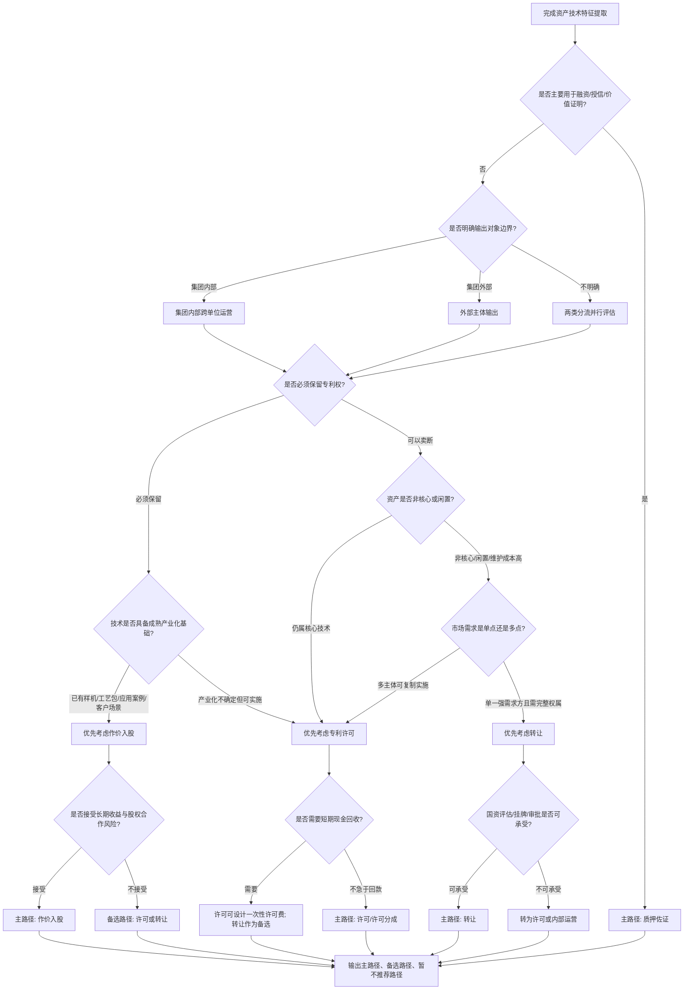

# 科技成果转化·对接对象发现（自有成果对外输出版）

## 定位

本 skill 服务于**央企科技管理部门**开展科技成果对外输出工作中的核心难点环节——**"找谁接"**。

通过调用智慧芽 MCP（专利检索 + 网络信息），将"凭经验找关系"转变为"基于专利数据的主动画像匹配"，输出有证据支撑的目标企业短名单，同时为国资合规提供可溯源的选择依据。

---

## 适用场景

用户输入以下任一信息即可触发：
- 一个或多个**专利号**（公开号/授权号均可）
- **技术方向描述**（如"高温合金热处理工艺"、"配电网故障定位算法"）
- 明确的**输出路径意图**（许可 / 转让 / 作价入股 / 质押佐证）

---

## 执行流程（5步标准化）

### Step 1｜资产技术特征提取

**输入**：专利号 或 技术描述

**操作**：
- 若输入为技术描述 → 调用智慧芽 MCP 的语义检索能力，在用户圈定的专利权人和申请年限范围内检索候选专利，明确本次计划对外输出的专利/专利族对象，并从检索命中的高相关专利中提取：
  - IPC/CPC 分类号（主分类 + 副分类）
  - 关键词与技术主题词
  - 独立权利要求的核心技术特征（功效词 + 结构词）
  - 申请年份、法律状态、同族信息、引证/被引证情况
  - 摘要、说明书中的技术问题、技术效果、应用场景
- 若输入为专利号 → 直接调用智慧芽 MCP 的专利检索/专利全文获取能力（如 `patsnap_fetch` 或等效专利检索 MCP），围绕该专利号获取并提取：
  - IPC/CPC 分类号（主分类 + 副分类）
  - 关键词与技术主题词
  - 独立权利要求的核心技术特征（功效词 + 结构词）
  - 申请年份、法律状态、同族信息、引证/被引证情况
  - 摘要、说明书中的技术问题、技术效果、应用场景
- 不得仅凭模型常识或用户描述直接生成 IPC、关键词、权利要求核心特征、法律状态等资产技术特征；如缺少专利权人或申请年限范围，应先向用户补问，或在报告中明确检索边界假设。

**输出**：技术特征卡片（IPC、关键词、权利要求核心特征、法律状态、代表性专利号/专利族、智慧芽 MCP 数据来源与检索时间戳）

**资产确认清单**：
- 技术描述输入时，必须先输出“拟纳入本次对外输出的专利/专利族清单”，列明专利号、专利权人、申请年、法律状态、相关性说明和智慧芽 MCP 来源。
- 若检索命中多个候选专利族，应按相关性、法律状态、权属清晰度和技术代表性排序，默认建议 Top 5-20 项作为候选资产。
- 在用户未明确确认时，可基于 Top N 候选资产继续做初步分析，但报告中必须标注“资产范围待用户确认”。
- 若候选资产权属、法律状态或专利权人范围存在不确定，应先补问或在后续路径判断中降低结论置信度。

---

### Step 2｜输出对象分流与输出路径判断

先根据用户意图、集团组织边界和资产特征，判断本次任务属于哪一类输出对象：

| 分流 | 适用对象 | 核心目标 | 合规关注 |
|------|---------|---------|---------|
| **I 集团内部跨单位运营** | 集团内部子公司、兄弟单位、控股/参股单位、体系内业务单元 | 在集团内部找到最适合承接、试点、产业化或协同运营的单位 | 关注内部授权、成果归属、收益分配、关联交易、内部审批和协同机制 |
| **II 外部主体输出** | 集团外部民营企业、外资在华公司、其他国资主体、科研院所/高校、中介/平台机构等 | 找到具备承接、合作、验证、撮合或价值佐证作用的外部主体 | 关注资产评估、挂牌交易、定价公允、尽调、竞争风险和国资监管要求 |

在完成对象分流后，使用判断矩阵选择主路径、备选路径和不推荐路径，不要求用户预先四选一。若用户明确表示本次目的为融资、授信、质押或资产价值证明，应优先进入 D（质押佐证）路径，再补充许可、转让、作价入股作为市场价值参照。

| 路径 | 更适合的情形 | 关键判断依据 | 典型风险/合规关注 |
|------|-------------|-------------|------------------|
| **A 专利许可** | 技术仍有长期价值，权利人希望保留所有权，适合多主体实施 | 专利仍在有效保护期；技术可复制应用；潜在需求方不止一家；权利人不希望卖断 | 许可范围、地域、期限、排他性、收益追踪和被许可方实施能力需明确 |
| **B 专利/技术转让** | 资产闲置或非核心，权利人希望一次性变现或剥离维护成本 | 与主业关联度下降；维护费/管理成本高；只有少数强需求方；买方需要完整权属 | 定价公允、资产评估、挂牌/审批、低价转让和未来收益让渡风险 |
| **C 作价入股** | 技术成熟度高，适合产业化，权利人希望分享长期收益 | 有样机/工艺包/应用案例；能形成产品、产线或业务；对方有市场、资金、团队；双方互补 | 估值难、股权治理复杂、商业化失败、退出机制和收益分配不确定 |
| **D 质押佐证** | 主要目标不是输出技术，而是证明资产市场价值、融资价值或盘活潜力 | 同类专利交易/许可活跃；被引和布局密度较高；资产权属清晰、法律状态稳定 | 价值证明不足、质押折扣、权利稳定性和可处置性要求高 |

路径判断顺序：
1. 先看是否主要用于融资、授信、质押或资产价值证明：若是，优先进入质押佐证路径，并将同类许可、转让、入股案例作为价值参照。
2. 再看是否必须保留专利权：必须保留时优先考虑许可或作价入股；可以卖断时再考虑转让。
3. 再看技术成熟度和产业化基础：仅具备可实施性但产业化不确定时偏许可；已有样机、工艺包、应用案例或客户场景时可考虑作价入股。
4. 再看资产是否属于核心技术：核心技术不宜轻易转让，优先许可、内部运营或作价入股；非核心、闲置、维护成本高的资产可考虑转让。
5. 再看市场需求结构：多主体可用时许可优先；单一强需求方且需要完整权属时转让或作价入股更现实。
6. 再看现金诉求和风险承受能力：短期回款优先转让或一次性许可费；接受长期收益和不确定性时考虑许可分成或作价入股。
7. 最后看合规与执行成本：国资场景下转让和作价入股通常合规动作更重；质押佐证属于价值证明/融资支撑路径，不等同于技术输出交易。

**输出要求**：Step 2 必须给出“推荐主路径 + 备选路径 + 暂不推荐路径”，并逐项说明判断依据、关键假设、需用户确认的信息和合规注意事项。

**路径判断流程图**：



> 若用户未明确分流类型，默认同时输出 I（集团内部跨单位运营）和 II（外部主体输出）两类候选名单；若交易路径信息不足，先基于上述判断矩阵给出初步路径建议，而不是简单默认 A/B。

---

### Step 3｜智慧芽 MCP 三轨检索与候选主体选择

**轨道 A：申请人维度**（找谁在这个技术空间活跃）

```
patsnap_search：
  - 检索条件：与我方专利同 IPC 分类
  - 时间范围：近 3-5 年
  - 策略：semantic + filter
  - 分流过滤：集团内部跨单位运营优先保留集团内子公司/兄弟单位/体系内业务单元；外部主体输出按主体标签分列，重点关注外部民营企业、外部外资在华公司、其他国资主体、科研院所/高校、中介/平台机构等，不一刀切排除央企/国企
  - 排序依据：申请量、申请趋势（增长型优先）
  - 提取字段：申请人名称、申请量、申请趋势、授权率
```

**轨道 B：引用/被引用维度**（找谁在关注/使用我方技术）

```
patsnap_search：
  - 检索条件：引用了我方专利、同族专利、同 IPC/CPC 类目基础专利或相似专利的企业申请
  - 重点关注：大量引用同类基础专利、与我方专利存在共同被引/共同引用关系、或技术演进路径相近的下游企业
  - 补充：web_search 查目标企业近期产品动态、融资、扩产公告
```

**轨道 C：产业链/应用场景维度**（找谁有真实承接场景）

```
patsnap_search + web_search：
  - 根据 Step 1 提取的应用场景词、技术效果词、下游产品词和产业链环节，检索上下游企业、集团内部业务单元、项目承担单位和产品化主体
  - 用智慧芽专利数据反向验证其技术相关性，至少匹配同 IPC/CPC、相似权利要求、同类技术问题/技术效果、配套应用专利中的一项
  - 重点识别“专利申请不一定最多，但拥有产线、客户、工程项目、试点场景或渠道资源”的承接主体
```

**申请人/主体归一化**：
- 对智慧芽返回的申请人、专利权人和候选主体做名称归一化，目标是把同一控制或同一业务主体下的母公司、子公司、分公司、历史名称、简称、英文名、集团名合并统计，同时避免把同名不同主体误合并。
- 归一化不得只靠字符串包含或模型猜测，应采用“多证据合并”：
  - 智慧芽返回的标准化申请人/当前申请人/原始申请人、专利族申请人和转让/权利人变更线索。
  - 企业全称、统一社会信用代码/组织机构代码（如可获取）、英文名、历史名称、简称、品牌名、集团名和常见别名。
  - 股权控制、同一实际控制人、集团公告、官网组织架构、年报或公开工商信息等公开证据。
  - 专利申请地址、发明人团队、同族/共同申请关系、专利转让链等辅助线索。
- 归一化输出必须保留两个层级字段：
  - “原始申请人名称”：逐条保留智慧芽原始返回的申请人/专利权人名称，不得覆盖或删除。
  - “归一化主体名称”：用于聚合申请量、申请趋势、授权率、引用关系和评分的主体名称。
- 报告中应给出“主体归一化映射表”，至少包含：原始申请人名称、归一化主体名称、合并依据、证据来源、置信度、是否需人工确认。
- 对强证据可自动合并，例如同一统一社会信用代码、明确历史名称、同一专利转让链、官网/年报披露的全资子公司关系。
- 对弱证据只能标记为“疑似同一主体/同集团主体”，不得直接合并评分，例如仅名称相似、仅简称相同、英文缩写相似、同城同业但无控制关系证据。
- 对集团型企业应区分“集团合并视角”和“实施主体视角”：集团合并视角用于判断技术空间活跃度，实施主体视角用于判断谁实际承接许可、转让、作价入股或试点验证。
- 集团内部单位需标注其在集团内的层级、业务板块和与专利权人的关系；外部主体需标注控股属性、实际控制人或国资/外资/民营属性的判断来源。

**专利证据准入门槛**：
候选主体进入正式推荐名单前，至少满足以下一项专利证据；否则只能进入观察名单或辅助名单：
- 近 3-5 年在同 IPC/CPC 或高度相近分类下有连续申请或增长趋势。
- 专利摘要、说明书或权利要求中出现同类技术问题、技术效果、应用场景或关键结构特征。
- 引用我方专利、同族专利、同类基础专利，或与我方资产存在共同引用/共同被引关系。
- 与我方资产存在相似权利要求结构、可替代技术路线或互补技术模块。
- 在下游应用场景中拥有配套专利布局，能证明其具备承接、实施或产业化基础。

**候选主体标签与推荐角色**：

候选主体必须先打“主体标签”，再打“推荐角色”，不要把主体身份与实际作用混为一类。

| 主体标签 | 类型标准 | 典型推荐用途 |
|----------|----------|--------------|
| **集团内部单位** | 集团内子公司、兄弟单位、控股/参股单位、业务板块单位 | 内部授权、试点验证、联合开发、协同运营 |
| **外部民营企业** | 集团外部、非国资控股的民营企业、上市民企、产业链企业 | 许可、转让、产业化合作、作价入股 |
| **外部外资在华公司** | 外资企业在中国设立的公司、合资公司、外资控股研发/生产主体 | 许可、合作开发、供应链导入、联合应用 |
| **其他国资主体** | 非本集团的央企、地方国企、国资控股企业 | 国资间合作、重大项目承接、产业链协同 |
| **科研院所/高校** | 高校、科研院所、事业单位研究机构 | 联合研发、验证测试、标准课题、技术完善 |
| **中介/平台机构** | 产权交易所、技术转移中心、产业园、孵化器、投资机构、行业协会 | 撮合、挂牌、路演、资源导入、交易服务 |

推荐角色可选：技术接收方、产业化承接方、联合研发方、试点验证方、交易撮合方、价值佐证参照方。主推荐名单优先包含集团内部单位、外部民营企业、外部外资在华公司、其他国资主体；科研院所/高校和中介/平台机构默认进入辅助合作名单，除非用户明确要求纳入主推荐名单。

**路径差异化检索重点**：

- **路径 A（许可）**：轨道 A 为主，重点筛选"申请活跃但权利要求覆盖存在空白"的企业
- **路径 B（转让）**：轨道 A 为主，附加筛选"历史上有通过转让获取专利记录"的企业
- **路径 C（作价入股）**：三轨并行，轨道 C 重点找下游应用场景、产业化主体和试点场景，结合 web_search 查融资状态、产能扩张和业务落地能力
- **路径 D（质押佐证）**：轨道 A + 轨道 B 为主，输出同类专利市场热度、被引数据、技术布局密度、活跃主体和可比交易/许可线索

---

### Step 4｜候选方打分与筛选

对检索到的候选主体按主体标签、推荐角色和交易路径分别打分。每个一级维度均按 100 分制给出原始分，再按权重折算为总分，便于业务人员理解和复核。

**计分公式**：
```
总分 = 技术匹配度原始分 × 技术匹配权重
     + 接收能力适配原始分 × 接收能力权重
     + 合作/承接意愿信号原始分 × 合作信号权重
     + 组织/地域/政策适配原始分 × 地域政策权重
     + 合规友好度原始分 × 合规权重
     - 风险扣分
```

示例：技术匹配度原始分为 80 分，默认权重为 35%，则计入总分 28 分；所有维度加权后总分仍为 100 分制。

**默认权重与评分依据**：

| 维度 | 默认权重 | 原始分评分依据（每项 0-100 分） |
|------|------|---------|
| 技术匹配度 | 35% | IPC/CPC 重叠度、关键词相似度、语义相似度、权利要求结构相似度、同类技术问题/技术效果、引用/被引用关系、配套应用专利 |
| 接收能力适配 | 25% | 企业规模、研发投入或专利活跃度、近 3-5 年申请趋势、授权率、产业化场景、产线/项目/客户、试点承接能力 |
| 合作/承接意愿信号 | 20% | 历史专利许可/转让/受让记录、技术合作公告、招投标/项目中标、融资扩产、产品发布、内部协同项目、同类技术空白 |
| 组织/地域/政策适配 | 10% | 集团内部业务归口、产业链位置、技术转移示范区、高新区、专精特新集群、目标产业政策覆盖地、集团重点区域 |
| 合规友好度 | 10% | 主体背景清晰、权属链清楚、无重大诉讼/失信/经营异常、关联关系可说明、可评估/可挂牌/可审批、竞争反制风险可控 |

**原始分档参考**：

| 原始分区间 | 含义 |
|------------|------|
| 90-100 | 强证据支持，多项证据一致，可直接作为重点推荐依据 |
| 75-89 | 证据较强，至少有一项核心证据，适合进入主推荐名单 |
| 60-74 | 中等相关，有部分证据但仍需补充验证 |
| 40-59 | 弱相关，主要是间接证据，通常进入观察名单 |
| 1-39 | 证据很弱或高度不确定，原则上不进入正式推荐名单 |
| 0 | 无证据、明显不匹配或存在排除风险 |

**路径权重调整**：

| 路径 | 技术匹配度 | 接收能力适配 | 合作/承接意愿信号 | 组织/地域/政策适配 | 合规友好度 |
|------|-----------|-------------|------------------|------------------|-----------|
| 专利许可 | 40% | 20% | 20% | 10% | 10% |
| 专利/技术转让 | 30% | 25% | 25% | 5% | 15% |
| 作价入股 | 30% | 30% | 20% | 5% | 15% |
| 质押佐证 | 35% | 10% | 15% | 10% | 30% |

**路径权重依据与调整原则**：
- 路径权重为业务启发式默认权重，不是法规规定、统计模型结论或强制规则。
- 权重设置依据包括：各交易路径的核心成功条件、国资场景下的风控重点、以及智慧芽 MCP 和公开信息可支撑的证据类型。
- 许可路径最关注技术是否匹配、是否可被多主体实施，因此提高技术匹配度权重。
- 转让路径更关注买方是否有完整权属需求、预算、承接动机和合规交易条件，因此提高接收能力、合作信号和合规权重。
- 作价入股路径本质是长期产业化合作，因此提高接收能力和合规权重，重点看产业化场景、团队、市场和治理可行性。
- 质押佐证路径重点不是寻找交易买方，而是证明资产稳定、可评估、可处置和具备市场价值，因此提高合规友好度和权利稳定性相关权重。
- 执行时可根据用户目标调整权重：短期回款提高合作信号和接收能力；合规稳妥优先提高合规友好度；集团内部运营提高组织适配和接收能力；市场化招商提高合作信号和接收能力；价值证明提高技术匹配、专利热度和合规稳定性。
- 报告中必须说明采用的权重版本、是否做过调整，以及调整原因，便于国资合规留痕和复核。

**主体标签修正**：
- 集团内部单位：接收能力重点看业务归口、试点场景、内部协同价值和内部审批可行性。
- 外部民营企业：重点看付费能力、产品化能力、增长动机、交易效率和经营稳定性。
- 外部外资在华公司：重点看本地实施权限、合规审批、供应链导入可能性和数据/技术出口限制。
- 其他国资主体：重点看国资审批链、项目属性、产业链协同、重大工程场景和定价公允性。
- 科研院所/高校：不与交易接收方混排，重点评价联合研发、验证测试、标准课题和技术完善价值。
- 中介/平台机构：不评价技术接收能力，重点评价资源覆盖、撮合能力、挂牌/路演能力和交易服务经验。

**证据等级**：

| 等级 | 标准 |
|------|------|
| A | 专利证据强，且产业/公开信息证据也强 |
| B | 专利证据强，但产业化能力或合作信号待补 |
| C | 有专利相关性，但承接能力或意愿证据弱 |
| D | 主要是间接线索，只能进入观察名单或辅助名单 |

**扣分和排除规则**：
- 重大诉讼、严重失信、经营异常、权属争议：视严重程度扣 10-30 分，严重时排除。
- 专利权属不清、法律状态异常或剩余保护期明显不足：降级、扣分或暂停推荐。
- 强竞争反制风险、潜在无效挑战风险高：扣分或列为谨慎推荐。
- 没有任何专利证据：不得进入正式推荐名单。
- 科研院所/高校、中介/平台机构默认不进入交易对象主榜，除非用户明确要求。

输出：按主体标签和推荐角色分别给出 Top 10-20 家候选主体，含各维度 100 分制原始分、加权总分、证据等级、风险扣分和推荐动作。

---

### Step 5｜生成向导式 HTML 交互页面与最终报告

默认交付物为可本地打开的 HTML 格式文件。HTML 首先呈现为分步向导式交互页面，引导用户逐页完成信息输入和选择；交互全部完成后，再生成交互式对接对象发现报告。不得一进入页面就直接展示完整报告大屏。

**视觉与交互要求**：
- 整体视觉采用科技风，深色背景，蓝黑为主色调；建议使用深蓝/近黑背景、冷蓝高亮、青蓝描边、半透明输入面板和清晰的步骤进度条。
- 页面应保持正式工作台风格，不做营销落地页，不使用大面积装饰性渐变或无意义视觉元素。
- 每个页面只完成一个明确交互任务，页面标题、输入提示、选项和下一步按钮必须清楚。
- 页面顶部或侧边展示步骤进度，例如：1 成果转化对象 → 2 成果转化路径 → 3 输出对象边界 → 4 权属与收益诉求 → 5 技术成熟度 → 6 目标主体要求 → 7 确认并生成报告。
- 用户输入后进入下一页面；允许返回上一步修改；最终确认页应汇总用户全部输入。
- 所有用户输入必须写入报告的“任务边界与输入记录”模块，作为后续检索、判断和合规留痕依据；展示标题必须使用中文业务字段名，不得直接展示 `asset_input`、`object_boundary`、`target_industry` 等英文变量名。

**交互一致性与防错规则**：
- “不确定/由系统判断”类选项若与明确选项并列，必须设计为互斥：选择“不确定/由系统判断”时清除同组其他选项；选择任何明确选项时自动取消“不确定/由系统判断”；保存时再做一次兜底校验。
- “输出对象边界”是主筛选条件，最终报告、目标主体短名单、评分表、Word 导出和 Excel/CSV 导出必须按该边界过滤，不能只在输入记录中留痕。
- 若用户选择“集团内部跨单位运营”，正式主推荐名单只允许展示“集团内部单位”；在未提供集团内部单位范围或未检索到有专利证据的内部主体时，应显示“内部候选待补充/暂无满足准入门槛的内部主体”，不得混入外部企业作为主榜。外部企业只能作为价值佐证或外部输出备选，并须明确标注。
- 若用户选择“外部主体输出”，正式主推荐名单只展示集团外部主体；集团内部单位不得进入主榜。若用户选择“两类都看”或“不确定/由系统判断”，才可并行展示内部与外部主体，并按主体标签分列或筛选。
- 页面三的“输出对象边界”用于限定本轮检索范围；页面六的“目标主体要求”用于对已检索候选进行评分、排序和排除。二者不得使用容易混淆的同名字段。
- 导出版本必须与当前页面显示的数据同口径，包括对象边界、筛选条件、分数、证据、推荐动作和空状态提示；不得导出另一套未过滤的全量候选表。

**向导页面序列**：

1. **页面一：成果转化对象**
   - 页面标题：成果转化对象
   - 输入提示：输入技术描述或者专利号
   - 输入控件：多行文本框，支持输入专利号、多个专利号或技术描述
   - 页面逻辑：
     - 若判断输入为专利号，进入页面二。
     - 若判断输入为技术描述，展示补充输入区，提醒用户提供“专利权人范围”和“申请年限范围”。
     - 若用户认为不需要限定范围，允许填写“无”；系统必须记录该选择，并在报告中标注检索边界为用户未限定。
   - 输出到后台字段：asset_input、input_type、patentee_scope、application_year_scope。

2. **页面二：成果转化路径**
   - 页面标题：成果转化路径
   - 输入提示：请选择或填写本次成果转化路径
   - 选择项：许可、转让、作价入股、质押佐证、不确定/由系统判断
   - 交互要求：支持选择一个或多个明确路径，但“不确定/由系统判断”必须与其他路径互斥；若用户选择“不确定/由系统判断”，后续按 Step 2 判断矩阵给出主路径、备选路径和暂不推荐路径。
   - 输出到后台字段：preferred_paths。

3. **页面三：输出对象边界**
   - 页面标题：输出对象边界
   - 输入提示：请选择希望优先寻找的承接对象范围
   - 选择项：集团内部跨单位运营、外部主体输出、两类都看、不确定/由系统判断
   - 补充输入应拆分为独立字段，不得把不同含义塞进同一个输入框：
     - 集团内部单位范围：希望优先纳入的集团内部板块、子公司、研究院或业务单元。
     - 集团内部排除单位：明确不纳入的内部单位；无则填写“无”。
     - 边界限定：重点区域或行业：用于限定本轮检索范围；选择集团内部时表示内部承接单位的行业/区域偏好，选择外部主体时表示外部检索边界。
   - 输出到后台字段：object_boundary、internal_scope、internal_excluded_units、external_scope_notes。

4. **页面四：权属与收益诉求**
   - 页面标题：权属与收益诉求
   - 输入提示：请说明是否必须保留专利权，以及是否需要短期现金回收
   - 页面必须拆成两个小区块，避免两个“暂不确定”造成误解：
     - 专利权保留要求：必须保留专利权、可以卖断、权属暂不确定。
     - 现金回收要求：需要短期现金回收、不急于回款、回款暂不确定。
   - 输出到后台字段：keep_ownership_requirement、cash_recovery_requirement。

5. **页面五：技术成熟度与应用基础**
   - 页面标题：技术成熟度
   - 输入提示：请说明该技术是否已有样机、工艺包、应用案例、客户场景或产业化基础
   - 选择项：已有成熟应用基础、已有初步验证、仅有专利/方案、暂不确定
   - 补充输入：应用场景、样机/工艺包/项目案例、产业化限制。
   - 输出到后台字段：maturity_level、application_basis。

6. **页面六：目标主体要求**
   - 页面标题：目标主体要求
   - 输入提示：请填写对目标主体的特别要求
   - 输入项：地域、规模、候选主体行业偏好、主体类型偏好、候选主体排除对象、是否接受科研院所/高校或中介/平台机构进入主推荐名单。
   - 字段含义必须与页面三区分清楚：
     - 页面三的“边界限定：重点区域或行业”用于限定本轮检索范围。
     - 页面六的“候选主体行业偏好”用于对已检索主体评分和排序。
     - 页面六的“候选主体排除对象”用于最终候选名单排除，不替代页面三的“集团内部排除单位”。
   - 输出到后台字段：target_region、target_scale、target_industry、subject_type_preference、excluded_subjects、support_entities_in_main_list。

7. **页面七：确认并生成报告**
   - 页面标题：确认并生成报告
   - 展示用户已输入的全部信息，允许返回修改。
   - 用户点击“生成报告”后，再调用智慧芽 MCP 执行资产提取、路径判断、三轨检索、主体归一化、证据准入和评分筛选。
   - 生成过程中展示阶段状态：资产识别中、路径判断中、候选主体检索中、评分筛选中、报告生成中。

**最终报告页面**：
交互完成后，HTML 切换为报告模式。报告模式应包含：
- 任务边界与输入记录
- 资产技术特征摘要
- 输出对象分流与路径判断
- 三轨检索与筛选过程
- 目标主体短名单与评分表
- 辅助合作/服务支撑名单
- 推荐对接策略与 30/60/90 天行动计划
- 检索方法、权重版本与合规留痕
- 限制说明与待补充信息

**最终报告交互要求**：
- 支持交互穿透：用户点击短名单主体、评分维度、专利证据、路径判断、检索方法等模块时，可展开查看明细、依据、原始证据和风险提示。
- 支持筛选、排序和切换视图：按主体标签、推荐角色、推荐路径、证据等级、总分区间、集团内部/外部主体输出进行筛选。
- 页面顶部和短名单区域均应提供导出入口，用户可选择导出 Word 版本整体报告或 Excel 版本候选名单和评分表。
- 若当前环境无法真实生成 Word/Excel 文件，HTML 中仍应保留导出按钮和导出说明，并在报告末尾标注“导出功能待运行环境支持”。
- 报告顶部统计、筛选项、短名单表格、辅助说明和导出数据必须随用户选择的输出对象边界动态变化；若当前边界下无正式候选，必须展示清晰空状态和下一步补充信息，而不是回退展示其他边界的候选。

**导出要求**：
- “导出 Word 版本整体报告”必须生成适合线性阅读、正式汇报、归档和审批流转的阅读友好版报告，不得直接复刻 HTML 页面样式、深色背景、按钮、筛选器、折叠面板、交互控件或网页布局。
- Word 版本应使用白底正式商务风格，标题使用深蓝色，正文使用黑色，表格使用浅蓝/浅灰表头，少量提示框用于关键结论、合规提示和待确认事项。
- Word 版本应重排为以下章节：封面、执行摘要、任务边界与用户输入记录、资产技术特征摘要、路径判断与推荐理由、检索与筛选方法、目标主体短名单、分主体详情、辅助合作/服务支撑名单、推荐对接策略与 30/60/90 天行动计划、风险限制与免责声明。
- Word 版本短名单先给总览表，再按主体逐项展开推荐理由、专利证据、产业/公开信息证据、主要风险和建议下一步；避免把网页中的展开卡片直接搬入 Word。
- “导出 Excel 版本候选名单和评分表”保持数据表导向，导出内容包括长名单、短名单、主体标签、推荐角色、各维度 100 分制原始分、加权总分、证据等级、风险扣分、专利证据、推荐动作。
- 若在纯静态 HTML 环境中无法稳定生成 `.xlsx`，可导出 CSV 数据表，但按钮和说明应明确“Excel/CSV 数据表”，并保证可由 Excel 直接打开；CSV 不保留多 sheet、样式和冻结窗格。
- 导出版本必须与 HTML 页面显示的数据一致，不能重新生成另一套口径；Word 可以重排表达形式，但不得改变结论、分数、证据和推荐动作。


---

## 关键设计原则

### 1. 国资合规优先
每份报告必须包含**检索方法说明**模块，记录数据来源、检索策略和时间戳，作为"为何选择这些对接对象"的可溯源依据，防范国资监管质疑。

### 2. 证据链完整
每家推荐企业必须附有至少一条专利检索证据（专利号或检索结果截图引用），不得仅凭网络信息推荐。

### 3. 路径适配输出
不同输出路径的候选企业画像不同：
- 许可方：需要"有需求、付得起、不会反向无效"
- 买方：需要"有预算、有战略动机、可挂牌交易"
- 入股方：需要"有产业化能力、资金状况良好、治理结构清晰"
- 质押佐证：不一定需要交易对象主推荐，重点输出市场数据、活跃主体、可比许可/交易线索和价值佐证分析

### 4. 分流标注与风险筛选
不得因候选方是央企/国企、集团内部子公司或兄弟单位而自动排除；应先判断其属于“集团内部跨单位运营”还是“外部主体输出”，并分别标注合规关注点。

以下主体应降权、标红或排除：
- 涉及重大诉讼、经营异常、严重失信或权属争议的主体
- 与我方存在高竞争风险且可能利用技术反制的主体
- 内部运营场景下，业务归口明显不匹配、缺少承接能力或内部审批障碍过高的主体
- 外部主体输出场景下，无法完成尽调、交易路径不清晰或定价公允性难以支撑的主体

---

## 用户交互规范

**启动问题**（如用户未提供足够信息时询问）：
优先通过 HTML 向导页面收集用户输入；在对话模式下才按以下问题补问：
1. 请提供拟输出资产的专利号或技术方向描述。
2. 若输入为技术描述，请提供拟检索的专利权人范围和申请年限范围；如不需要限定，可填写“无”。
3. 请选择成果转化路径：许可 / 转让 / 作价入股 / 质押佐证 / 不确定由系统判断；其中“不确定由系统判断”应与其他路径互斥。
4. 本次希望优先做哪类输出：集团内部跨单位运营 / 外部主体输出 / 两类都看 / 不确定由系统判断。
5. 是否必须保留专利权？是否需要短期现金回收？
6. 技术是否已有样机、工艺包、应用案例、客户场景或产业化基础？
7. 对目标主体有无特别要求？（集团内部单位范围、集团内部排除单位、边界限定的重点区域或行业、候选主体地域/规模/行业偏好、主体类型偏好、候选主体排除对象、是否接受科研院所/高校或中介/平台机构进入主推荐名单）

**中间过程**：
- 每完成一个 Step，简要告知用户进展
- 检索结果超过 50 家候选时，先输出初筛逻辑再输出短名单

**输出格式**：
- 默认生成向导式交互 HTML 文件，先逐页收集用户输入，再生成最终报告。
- 页面一标题为“成果转化对象”，提示输入技术描述或者专利号；技术描述场景需补充专利权人范围和申请年限范围，用户可填写“无”。
- 页面二标题为“成果转化路径”，提供许可、转让、作价入股、质押佐证、不确定由系统判断等选项。
- 后续页面继续收集输出对象边界、权属与收益诉求、技术成熟度、目标主体要求；全部交互完成后生成报告。
- 最终报告页面内提供导出入口，由用户自行选择是否导出 Word 版本整体报告或 Excel/CSV 版本候选名单和评分表；Word 必须为阅读友好的正式报告版，Excel/CSV 必须为数据表版。

---

## MCP 工具调用规范

| 工具 | 用途 | 调用时机 |
|------|------|---------|
| `patsnap_search` | 技术描述输入时做语义/关键词/过滤检索并圈定拟输出专利；后续检索同领域活跃申请人、同 IPC/CPC 技术空间、引用关系和产业链应用主体 | Step 1（输入为技术描述时）+ Step 3 三轨检索 |
| `patsnap_fetch` | 按专利号或智慧芽 URL 获取专利全文、摘要、权利要求、说明书、引用、法律状态、同族等模块，提取技术特征 | Step 1（输入为专利号时）+ Step 3 证据核验 |
| `search_patent_by_pn` | 通过公开号或申请号检索智慧芽标准专利号，并返回当前申请人、原始申请人、发明人、申请日、公开日 | Step 1 辅助：号码格式不统一或需标准化资产清单时 |
| `legal_status` | 查询专利简单法律状态、法律状态和法律事件 | Step 1 资产核验 + Step 4 风险筛选 |
| `re_examination_data` | 查询复审、无效信息，包括案件类型、决定号、决定日、请求人和法律依据 | Step 4 权利稳定性和风险扣分 |
| `fee_info` | 按申请号创建缴费信息获取任务，用于辅助核验年费和维持状态 | Step 1/Step 4：需要评估维护状态、转让/质押可处置性时 |
| `web_search` + `web_fetch` | 查目标企业融资、扩产、产品、合作公告、产线和项目能力 | Step 3/Step 4 辅助；公开信息不能替代专利证据 |

---

## 典型调用示例

**示例 1：专利许可场景**
> 用户："我有一批储能领域的专利，想找合适的许可对象，专利号是 CN112345678A"

执行路径：Step1（fetch专利）→ Step2（判断路径A）→ Step3（检索储能领域活跃民营企业）→ Step4（打分筛选）→ Step5（输出报告）

**示例 2：作价入股场景**
> 用户："我们有一套成熟的污水处理工艺，想找能产业化落地的企业合作入股"

执行路径：Step1（构建关键词组）→ Step2（判断路径C）→ Step3（检索下游环保应用企业+web查融资动态）→ Step4（打分）→ Step5（输出报告）

**示例 3：批量盘点场景**
> 用户："我有20个闲置专利，帮我全部找一遍对接对象"

执行路径：批量执行Step1，按IPC分类合并同类检索，分组输出报告

## 使用前配置
本 Skill 依赖智慧芽开放平台 MCP 服务：
- 完成安装、初次使用时需进行自检，参见 README.md
- 用户需完成账号授权，并确保 Agent 环境已启用对应 MCP 工具
- 若未完成配置，本 Skill 只能提供分析框架，无法检索实时数据或生成基于数据库的结论
- 缺少MCP配置时，引导用户参照 README.md 在 [[open.zhihuiya.com](https://open.zhihuiya.com/)](https://open.zhihuiya.com/) 获取MCP。
